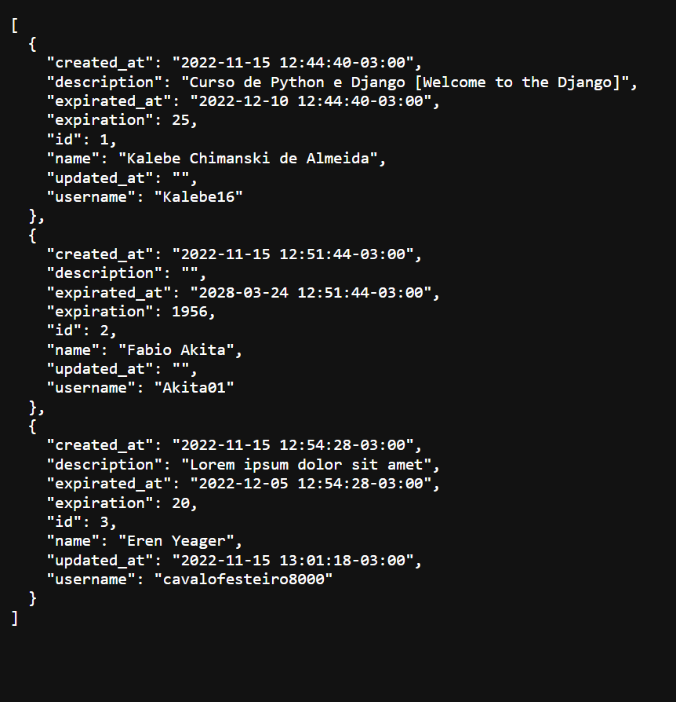

# itflex_desafio_backend_api

<h1 align="center">API Rest [ITFLEX]</h1>

<h3>Descrição do projeto:</h3>

<strong>- API desenvolvida utilizando Python, Flask, SQLAlchemy</strong>

<strong>- CRUD básico para gerenciamento de certificados</strong>

<h3>Pré requisitos:</h3>

<strong>- Ter o python instalado.</strong>

<h3>Para testar o projeto:</h3>

<strong>1- git clone https://github.com/Kalebe16/itflex_desafio_backend_api.git</strong>

<strong>2- pip install -r requirements.txt</strong>

<strong>3- python api.py</strong>

<h3>Endpoints da api</h3>

| Método   | Endpoint | Descrição  |
| -------- | -------- | ---------- |
| `GET`    | /certificados  | Obtém todos os certificados. | 
| `GET`    | /certificados/`ID` | Obtém um certificado pelo seu `ID`. |
| `POST`   | /certificados  | Cadastra um novo certificado. |
| `PUT`    | /certificados/`ID` | Edita um certificado pelo seu `ID`. |
| `DELETE` | /certificados/`ID` | Deleta um certificado pelo seu `ID`. |

<h3>Respostas</h3>

| Código  | Descrição                                                              |
| ------- | ---------------------------------------------------------------------- |
| `200`     | Requisição executada com sucesso.                                      |
| `201`     | Requisição bem sucedida, um novo certificado foi criado como resultado.|
| `404`     | Certificado pesquisado não encontrado.                                 |
| `422`     | Dados informados estão fora do escopo definido para um ou mais campos. |

<h3 align="center">A API deve se parecer com isto:</h3>

### Request

`POST /thing/`

    curl -i -H 'Accept: application/json' -d 'name=Foo&status=new' http://localhost:7000/thing

### Response

    HTTP/1.1 201 Created
    Date: Thu, 24 Feb 2011 12:36:30 GMT
    Status: 201 Created
    Connection: close
    Content-Type: application/json
    Location: /thing/1
    Content-Length: 36

    {"id":1,"name":"Foo","status":"new"}

